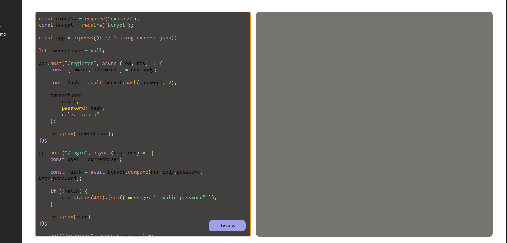
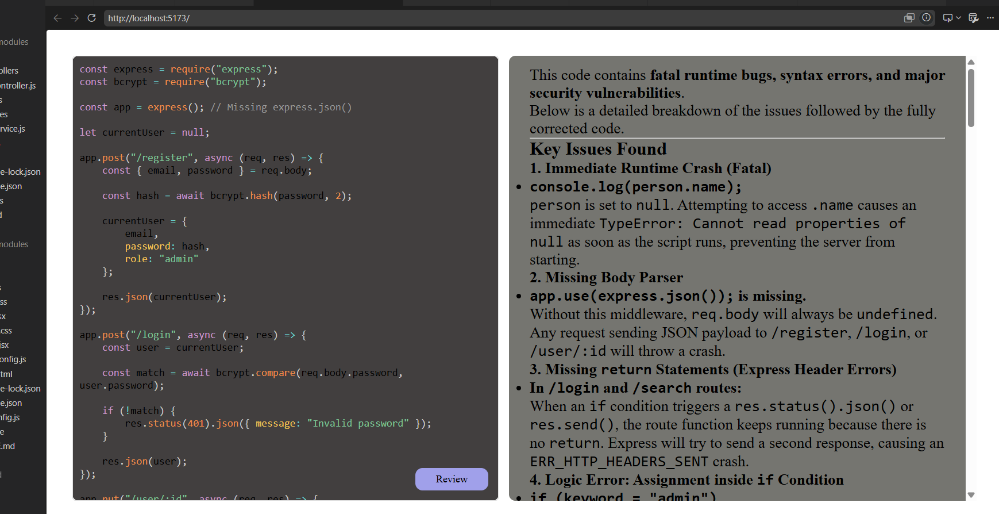

# 🤖 AI Code Reviewer

An AI-powered code review web application built with the MERN stack and Google's Gemini API. The application analyzes source code and provides structured, production-oriented feedback on correctness, code quality, security, performance, maintainability, and best practices.

---

## 🚀 Features

- AI-powered code analysis
- Structured code review reports
- Highlights problematic code snippets
- Suggests recommended fixes
- Security and performance analysis
- Code quality assessment
- Production-ready improvement suggestions
- Modern React frontend
- Express.js REST API backend
- Gemini AI integration

---

## 📸 Screenshots

### Home Page




### Generated Code Review




---

## 🛠 Tech Stack

### Frontend

- React.js
- Vite
- Axios
- CSS

### Backend

- Node.js
- Express.js

### AI

- Google Gemini API
- @google/genai SDK

### Tools

- Git
- GitHub
- Postman
- VS Code

---

## 📂 Project Structure

```
AI-Code-Reviewer/
│
├── Backend/
│   ├── src/
│   │   ├── controllers/
│   │   ├── routes/
│   │   ├── services/
│   │   └── app.js
│   ├── server.js
│   └── package.json
│
├── Frontend/
│   ├── src/
│   ├── public/
│   └── package.json
│
└── README.md
```

---

## ⚙️ Installation

### Clone Repository

```bash
git clone <repository-url>
```

### Backend

```bash
cd Backend
npm install
```

Create a `.env` file

```env
PORT=3000
GEMINI_API_KEY=YOUR_API_KEY
```

Start Backend

```bash
npm run dev
```

---

### Frontend

```bash
cd Frontend
npm install
npm run dev
```

---

## 📌 Usage

1. Open the application.
2. Paste your source code.
3. Click **Review**.
4. Wait for the AI response.
5. Review the generated report.

---

## 📄 Sample Output

The application generates reports containing:

- Overall Summary
- Bad Code
- Issues Found
- Recommended Fix
- Improvements
- Best Practices
- Additional Notes

---

## 🔮 Future Improvements

- Authentication
- Review History
- Multiple Programming Languages
- Markdown Rendering
- Syntax Highlighting
- Export Review as PDF
- Dark/Light Theme
- Rate Limiting
- Docker Support
- Unit Testing
- CI/CD Pipeline

---

## 🧠 What I Learned

Through this project I gained hands-on experience with:

- React.js
- Node.js
- Express.js
- REST API Development
- Gemini AI Integration
- Prompt Engineering
- Backend Architecture
- Error Handling
- API Integration
- Debugging Frontend-Backend Communication
- Environment Variable Management
- Git & GitHub

---

## 👨‍💻 Author

**Ashish Gautam**

---

## 📜 License

This project is licensed under the MIT License.